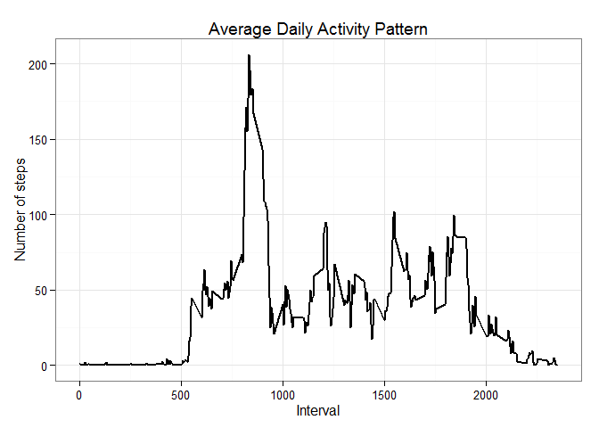

# Reproducible Research: Peer Assessment 1


## Loading and preprocessing the data

- Basic settings

```r
echo = TRUE  # Always make code visible
options(scipen = 1)  # Turn off scientific notations for numbers
```

- Load required libraries & data

```r
library(ggplot2)
library(plyr)
library(scales)

unzip("activity.zip")
Activity <- read.csv("activity.csv")
```

- Create a subset with NA removed

```r
ActivityNoNAs <- subset(Activity, is.na(Activity$steps) == F)

# format date and interval columns
ActivityNoNAs <- mutate(ActivityNoNAs,date = as.Date(ActivityNoNAs$date))
ActivityNoNAs <- mutate(ActivityNoNAs,interval=as.factor(ActivityNoNAs$interval))
```

## What is mean total number of steps taken per day?

-  Make a time series plot (i.e. type = "l") of the 5-minute interval (x-axis) and the average number of steps taken, averaged across all days (y-axis)

```r
steps_per_day <- aggregate(steps ~ date, ActivityNoNAs, sum)
colnames(steps_per_day) <- c("date","steps")
```

-  Histogram of the total number of steps taken each day

```r
ggplot(steps_per_day, aes(x = date, y = steps)) + 
    geom_bar(stat = "identity",fill="Blue" ) +
    theme_classic() +
    labs(title="Histogram of Steps Taken per Day",x = "Date", y = "Steps by day") +
    scale_x_date(labels = date_format("%d-%m-%Y"))
```

 

- Calculate overall mean of total number of steps taken per day

```r
steps_mean   <- round(mean(steps_per_day$steps),0)
steps_median <- median(steps_per_day$steps)
```

##### Mean Steps Taken per Day 10766 steps, with median of 10765.

## What is the average daily activity pattern?

- Calculate average steps for each interval for all days.

```r
steps_per_interval <- aggregate(ActivityNoNAs$steps, 
                                by = list(interval = ActivityNoNAs$interval),
                                FUN=mean)
#convert interval to integer
steps_per_interval$interval <- 
        as.integer(levels(steps_per_interval$interval)[steps_per_interval$interval])

colnames(steps_per_interval) <- c("interval", "steps")
```

- Plot the Average Number Steps per Day by Interval.

```r
ggplot(steps_per_interval, aes(x=interval, y=steps)) +   
        geom_line(color="black", size=1) +  
        labs(title="Average Daily Activity Pattern", x="Interval", y="Number of steps") +  
        theme_bw()
```

 

- Find interval with most average steps.

```r
max_interval <- steps_per_interval[which.max(steps_per_interval$steps),1]
max_steps <- round(steps_per_interval[which.max(steps_per_interval$steps),2],0)
```

The 835 th interval has maximum of 206 steps.

## Imputing missing values

- Calculate and report the total number of missing values in the dataset (i.e. the total number of rows with NAs)

```r
sum(is.na(Activity$steps))
```

```
## [1] 2304
```

- Devise a strategy for filling in all of the missing values in the dataset. The strategy does not need to be sophisticated.

        All NAs are to be populated with overall average value for that 5-min interval

- Create a new dataset that is equal to the original dataset but with the missing data filled in.


```r
imputed <- Activity

for (i in 1:nrow(imputed)){
        if (is.na(imputed$steps[i])){
                imputed$steps[i] <- steps_per_interval$steps[which(imputed$interval[i] == steps_per_interval$interval)]}
}

imputed <- arrange(imputed, interval)
```

- Make a histogram of the total number of steps taken each day and Calculate 
  and report the mean and median total number of steps taken per day. Do these 
  values differ from the estimates from the first part of the assignment? 
  What is the impact of imputing missing data on the estimates of the total daily number of steps?

- calculating the total number of steps taken each day

```r
totalPerDayImputed <- ddply(imputed, .(date), summarise, steps=sum(steps))
#creating the plot

hist(totalPerDayImputed$steps, breaks = 20, main="Number of Steps", xlab="Total number of steps taken each day", ylab = "Number of Days", col="blue")
```

 

- Calculate and report the mean and median total number of steps taken per day on the imputed dataset

```r
mean(totalPerDayImputed$steps)
```

```
## [1] 10766.19
```

```r
median(totalPerDayImputed$steps)
```

```
## [1] 10766.19
```

- Test does these values differ from thoes in the first part

```r
abs(mean(steps_per_day$steps)-mean(totalPerDayImputed$steps))
```

```
## [1] 0
```

```r
abs(median(steps_per_day$steps)- median(totalPerDayImputed$steps))/median(steps_per_day$steps)
```

```
## [1] 0.0001104207
```
The mean didn't change after the imputing, the median slightly changed about 0.1% of the original value.

Total steps taken per day difference:

```r
totalDifference <- sum(imputed$steps) - sum(ActivityNoNAs$steps)
totalDifference
```

```
## [1] 86129.51
```

## Are there differences in activity patterns between weekdays and weekends?

- Create a new factor variable in the dataset with two levels -- "weekday" 
  and "weekend" indicating whether a given date is a weekday or weekend day.

```r
imputed$weekdays <- weekdays(as.Date(imputed$date))
imputed$weekdays <- ifelse(imputed$weekdays %in% c("Saturday", "Sunday"),"weekend", "weekday")
```
- Make a panel plot containing a time series plot (i.e. type = "l") of the 5-minute 
  interval (x-axis) and the average number of steps taken, averaged across all weekday 
  days or weekend days (y-axis).

- Calcluating the average for each interval

```r
average <- ddply(imputed, .(interval, weekdays), summarise, steps=mean(steps))
```

- Creating the plot

```r
library(lattice)
xyplot(steps ~ interval | weekdays, data = average, layout = c(1, 2), type="l", xlab = "Interval", ylab = "Number of steps")
```

 
